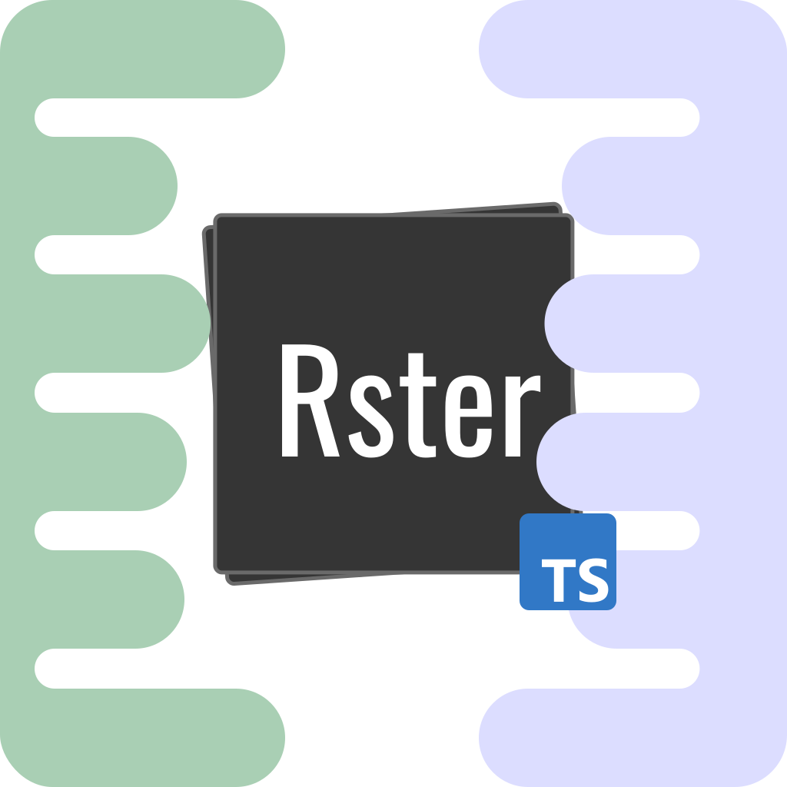

<a name="readme-top"></a>
[![Github Shield][github-shield]][github-url]
[![NPM Shield][npm-shield]][npm-url]
[![Documentation][documentation-shield]][documentation-url]
[![TypeDoc][typedoc-shield]][typedoc-url]

[![Build Status][build-shield]][build-url]
[![Contributors][contributors-shield]][contributors-url]
[![Forks][forks-shield]][forks-url]
[![Stargazers][stars-shield]][stars-url]
[![Issues][issues-shield]][issues-url]
[![BSD-3-Clause][license-shield]][license-url]
[![NPM][version-shield]][npm-url]
[![Downloads][downloads-shield]][npm-url]
[![Coverage][coverage-shield]][coverage-url]

<!-- PROJECT LOGO -->
<br />
<div align="center">
  <a href="https://github.com/nsc-de/rster">
    
  </a>

<h3 align="center">rster</h3>

  <p align="center">
    <font color="red"><s>build</s></font> design the backend of your dreams
    <br />
    <a href="https://github.com/nsc-de/rster"><strong>Explore the docs »</strong></a>
    <br />
    <br />
    <a href="https://github.com/nsc-de/rster">View Demo</a>
    ·
    <a href="https://github.com/nsc-de/rster/issues">Report Bug</a>
    ·
    <a href="https://github.com/nsc-de/rster/issues">Request Feature</a>
  </p>
</div>

<!-- TABLE OF CONTENTS -->
<details>
  <summary>Table of Contents</summary>
  <ol>
    <li>
      <a href="#about-the-project">About The Project</a>
      <ul>
        <li><a href="#built-with">Built With</a></li>
      </ul>
    </li>
    <li>
      <a href="#getting-started">Getting Started</a>
      <ul>
        <li><a href="#prerequisites">Prerequisites</a></li>
        <li><a href="#installation">Installation</a></li>
      </ul>
    </li>
    <li><a href="#usage">Usage</a></li>
    <li><a href="#roadmap">Roadmap</a></li>
    <li><a href="#contributing">Contributing</a></li>
    <li><a href="#license">License</a></li>
    <li><a href="#contact">Contact</a></li>
    <li><a href="#acknowledgments">Acknowledgments</a></li>
  </ol>
</details>

<!-- ABOUT THE PROJECT -->

## About The Project

[![Product Name Screen Shot][product-screenshot]](https://example.com)

<p align="right">(<a href="#readme-top">back to top</a>)</p>

### Built With

[![typescript][typescript-shield]][typescript-url]
[![nodejs][nodejs-shield]][nodejs-url]
[![npm][npm-package-manager-shield]][npm-package-manager-url]
[![eslint][eslint-shield]][eslint-url]
[![jest][jest-shield]][jest-url]
[![express][express-shield]][express-url]

- [typescript][typescript-url]
- [nodejs][nodejs-url]
- [npm][npm-package-manager-url]
- [eslint][eslint-url]
- [jest][jest-url]
- [express][express-url]

<p align="right">(<a href="#readme-top">back to top</a>)</p>

<!-- GETTING STARTED -->

## Getting Started

Hello and welcome to the rster project. Rster is the easiest way to build your backend api in nodejs. It is a framework that allows you to build your api in a modular way. Just define your library then use your functions to access and modify your data. Or directly add it to the express app using `express.use()`. It is up to you. You can even generate a typescript client directly from your server-side api definition!

### Prerequisites

- npm

  ```sh
  npm install npm@latest -g
  ```

  alternatively you can use yarn

  ```sh
    npm install yarn@latest -g
  ```

### Installation

1. Install the package

   ```sh
   npm install rster
   ```

   using yarn

   ```sh
    yarn add rster
   ```

2. Import the package

   ```js
   import rster from "rster";
   ```

<p align="right">(<a href="#readme-top">back to top</a>)</p>

<!-- USAGE EXAMPLES -->

## Usage

Use this space to show useful examples of how a project can be used. Additional screenshots, code examples and demos work well in this space. You may also link to more resources.

_For more examples, please refer to the [Documentation](https://example.com)_

<p align="right">(<a href="#readme-top">back to top</a>)</p>

<!-- ROADMAP -->

<!-- ## Roadmap

- [ ] Feature 1
- [ ] Feature 2
- [ ] Feature 3
  - [ ] Nested Feature

See the [open issues](https://github.com/nsc-de/rster/issues) for a full list of proposed features (and known issues).

<p align="right">(<a href="#readme-top">back to top</a>)</p> -->

<!-- CONTRIBUTING -->

## Contributing

Contributions are what make the open source community such an amazing place to learn, inspire, and create. Any contributions you make are **greatly appreciated**.

If you have a suggestion that would make this better, please fork the repo and create a pull request. You can also simply open an issue with the tag "enhancement".
Don't forget to give the project a star! Thanks again!

1. Fork the Project
2. Create your Feature Branch (`git checkout -b feature/AmazingFeature`)
3. Commit your Changes (`git commit -m 'Add some AmazingFeature'`)
4. Push to the Branch (`git push origin feature/AmazingFeature`)
5. Open a Pull Request

<p align="right">(<a href="#readme-top">back to top</a>)</p>

<!-- LICENSE -->

## License

Distributed under the BSD-3-Clause License. See `LICENSE` for more information.

<p align="right">(<a href="#readme-top">back to top</a>)</p>

<!-- CONTACT -->

## Contact

Nicolas Schmidt

[![twitter][contact-twitter-shield]][contact-twitter-url] [![github][contact-github-shield]][contact-github-url]

Project Link: [https://github.com/nsc-de/rster](https://github.com/nsc-de/rster)

[![GitHub][github-shield]][github-url]

<p align="right">(<a href="#readme-top">back to top</a>)</p>

<!-- ACKNOWLEDGMENTS -->

<!-- ## Acknowledgments

- []()
- []()
- []()

<p align="right">(<a href="#readme-top">back to top</a>)</p> -->

<!-- MARKDOWN LINKS & IMAGES -->
<!-- https://www.markdownguide.org/basic-syntax/#reference-style-links -->

<!-- link shields -->

[github-shield]: https://img.shields.io/badge/github-grey?style=for-the-badge&logo=github
[github-url]: https://github.com/nsc-de/rster
[npm-shield]: https://img.shields.io/badge/npm-red?style=for-the-badge&logo=npm
[npm-url]: https://www.npmjs.com/package/rster
[typedoc-shield]: https://img.shields.io/badge/typedoc-darkblue?style=for-the-badge&logo=typescript
[typedoc-url]: https://nsc-de.github.io/rster/
[documentation-shield]: https://img.shields.io/badge/documentation-blue.svg?style=for-the-badge&logo=github
[documentation-url]: https://nsc-de.github.io/rster/

<!-- Info Shields -->

[forks-shield]: https://img.shields.io/github/forks/nsc-de/rster.svg?style=for-the-badge
[forks-url]: https://github.com/nsc-de/rster/network/members
[stars-shield]: https://img.shields.io/github/stars/nsc-de/rster.svg?style=for-the-badge
[stars-url]: https://github.com/nsc-de/rster/stargazers
[issues-shield]: https://img.shields.io/github/issues/nsc-de/rster.svg?style=for-the-badge
[issues-url]: https://github.com/nsc-de/rster/issues
[license-shield]: https://img.shields.io/github/license/nsc-de/rster.svg?style=for-the-badge
[license-url]: https://github.com/nsc-de/rster/blob/master/LICENSE.txt
[product-screenshot]: images/screenshot.png
[build-shield]: https://img.shields.io/github/actions/workflow/status/nsc-de/rster/ci.yml?style=for-the-badge
[build-url]: https://github.com/nsc-de/rster/actions/workflows/ci.yml
[contributors-shield]: https://img.shields.io/github/contributors/nsc-de/rster.svg?style=for-the-badge
[contributors-url]: https://github.com/nsc-de/rster/graphs/contributors
[version-shield]: https://img.shields.io/npm/v/rster.svg?style=for-the-badge
[version-url]: https://www.npmjs.com/package/rster/
[downloads-shield]: https://img.shields.io/npm/dt/rster.svg?style=for-the-badge
[downloads-url]: https://www.npmjs.com/package/rster/
[coverage-shield]: https://img.shields.io/codecov/c/github/nsc-de/rster?style=for-the-badge
[coverage-url]: https://codecov.io/gh/nsc-de/rster

<!--Build With-->

[typescript-shield]: https://img.shields.io/badge/TypeScript-007ACC?style=for-the-badge&logo=typescript&logoColor=white
[typescript-url]: https://www.typescriptlang.org/
[npm-package-manager-shield]: https://img.shields.io/badge/npm-red?style=for-the-badge&logo=npm&logoColor=white
[npm-package-manager-url]: https://www.npmjs.com/
[express-shield]: https://img.shields.io/badge/Express.js-404D59?style=for-the-badge
[express-url]: https://expressjs.com/
[jest-shield]: https://img.shields.io/badge/-Jest-C21325?style=for-the-badge&logo=jest&logoColor=white
[jest-url]: https://jestjs.io/
[nodejs-shield]: https://img.shields.io/badge/Node.js-43853D?style=for-the-badge&logo=node.js&logoColor=white
[nodejs-url]: https://nodejs.org/en/
[eslint-shield]: https://img.shields.io/badge/eslint-4B32C3?style=for-the-badge&logo=eslint&logoColor=white
[eslint-url]: https://eslint.org/

<!-- Contact Shields -->

[contact-twitter-shield]: https://img.shields.io/badge/@nsc_dev-1DA1F2?style=for-the-badge&logo=twitter&logoColor=white
[contact-twitter-url]: https://twitter.com/nsc_dev
[contact-github-shield]: https://img.shields.io/badge/@nsc--de-100000?style=for-the-badge&logo=github&logoColor=white
[contact-github-url]: github.com/nsc-de
